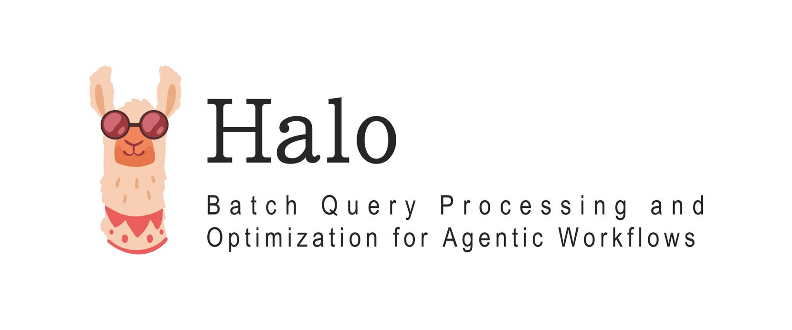
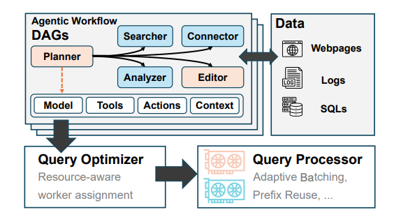

<div style="text-align: center;">
    
    <br>
    <a href="https://arxiv.org/abs/2509.02121" target="_blank">
    
    </a>
</div>


# Halo: Batch Query Processing and Optimization for Agentic Workflows
Here is the prototype for Halo, a novel system that unifies LLM serving with query optimization
to efficiently process batch agentic workflows.

<div style="text-align: center;">
    
</div>

We identify key features in our design:

- **Unified Framework**: Halo integrates LLM serving and query optimization into a single framework, simplifying deployment and management.
- **Batch Processing**: The system is optimized for batch processing, allowing for efficient handling of large volumes of queries leveraging techniques like cache reuse and prefix caching.
- **Query Optimization**: Halo employs advanced techniques to optimize query execution, targeting reduced latency and redundant context exchange while adapting to varying workloads and resource availability.

We hope Halo can be deployed in broader scenarios and achieve larger cost savings in the era of large generative models.
## Installation
1. Install [uv](https://astral.sh/uv/) for environment management:
```bash
curl -LsSf https://astral.sh/uv/install.sh | sh
source ~/.bashrc
```

2. Build Halo's environment:
```bash
uv venv
uv sync
source .venv/bin/activate
```

## Usage
1. Build a declarative YAML configuration file for your workflow. Example:
```yaml
start_ops:
  - op0
end_ops:
  - op1

ops:
  op0:
    model: meta-llama/Llama-3.2-3B-Instruct
    prompt: "Please try to answer the question with multi-step Chain of Thought."
    max_tokens: 512
    input_ops: []
    output_ops:
      - op1

  op1:
    model: meta-llama/Llama-3.1-8B-Instruct
    prompt: "Please answer the question again based on the previous context and your own reasoning."
    max_tokens: 1024
    input_ops:
      - op0
    output_ops: []

```
2. Create your queries
```python
from halo.components import Query
queries = [
    Query(
        id = 0,
        prompt = "What is the capital of France?",
    )
    ...
]
```
3. Execute with Halo's optimizer
```python
from halo.optimizers import Optimizer_v

optimizer = Optimizer_v(YAML_CONFIG_PATH)
queries = optimizer.execute(queries, return_queries=True)
```
## Citation
If you find this project useful, please consider citing our work:
```bib
@misc{shen2025batchqueryprocessingoptimization,
      title={Batch Query Processing and Optimization for Agentic Workflows}, 
      author={Junyi Shen and Noppanat Wadlom and Yao Lu},
      year={2025},
      eprint={2509.02121},
      archivePrefix={arXiv},
      primaryClass={cs.DB},
      url={https://arxiv.org/abs/2509.02121}, 
}
```