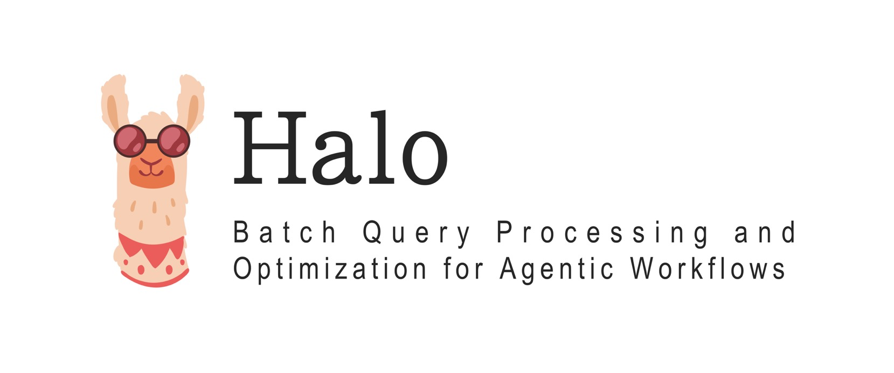
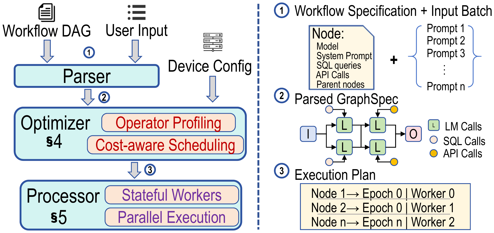

<div style="text-align: center;">
    
    <br>
    <a href="https://arxiv.org/abs/2509.02121" target="_blank">
    
    </a>
</div>


# Halo: Batch Query Processing and Optimization for Agentic Workflows
Here is the prototype for Halo, a novel system that unifies LLM serving with query optimization
to efficiently process batch agentic workflows.

<div style="text-align: center;">
    
</div>

We identify key features in our design:

- **Unified Framework**: Halo integrates LLM serving and query optimization into a single framework, simplifying deployment and management.
- **Batch Processing**: The system is optimized for batch processing, allowing for efficient handling of large volumes of queries leveraging techniques like cache reuse and prefix caching.
- **Query Optimization**: Halo employs advanced techniques to optimize query execution, targeting reduced latency and redundant context exchange while adapting to varying workloads and resource availability.

We hope Halo can be deployed in broader scenarios and achieve larger cost savings in the era of large generative models.
## Installation
1. Install [uv](https://astral.sh/uv/) for environment management:
```bash
curl -LsSf https://astral.sh/uv/install.sh | sh
source ~/.bashrc
```

2. Build Halo's environment:
```bash
uv venv
uv sync
source .venv/bin/activate
```

Pure-LLM workflows need nothing more. Workflows that attach SQL `db_queries`
to a node additionally require a Postgres backend — install that extra with
`uv sync --extra postgres`.

> The DP scheduler has an optional Rust core in the full research build. This
> demo ships the pure-Python implementation only; the DP solver automatically
> falls back to Python, producing identical plans.

## Usage
1. Describe your workflow as a declarative graph (`templates/example_chain.yaml`).
A graph has typed `nodes` (an `input` node plus `inference` nodes with
`engine: vllm`) and `edges` that map one node's outputs into the next node's
inputs:
```yaml
graph:
  name: example_two_stage_cot
  nodes:
    - id: user_input
      type: input
      outputs: [user_query]
    - id: reason
      type: inference
      engine: vllm
      model: meta-llama/Llama-3.2-3B-Instruct
      system_prompt: "Answer with multi-step chain-of-thought reasoning."
      inputs: [user_query]
      outputs: [reasoning]
    - id: answer
      type: inference
      engine: vllm
      model: meta-llama/Llama-3.1-8B-Instruct
      system_prompt: "Using the prior reasoning, give a concise final answer."
      inputs: [user_query, reasoning]
      outputs: [final_answer]
  edges:
    - {from: user_input, to: reason,  mapping: {user_query: "{{ user_query }}"}}
    - {from: reason,     to: answer,  mapping: {user_query: "{{ user_query }}", reasoning: "{{ reasoning }}"}}
```
A node may also carry `db_queries` (SQL with `:named` parameters); Halo splits
those into standalone CPU nodes and schedules them alongside the LLM nodes.

2. Parse the graph, build an optimized execution plan, and run a batch:
```python
from halo import GraphTemplateParser, GraphOptimizer, MultiProcessGraphProcessor

# 1) Parse the declarative workflow into a typed graph
graph = GraphTemplateParser("templates/example_chain.yaml").parse()

# 2) Optimize: a single-pass DP picks node order, worker placement, and query
#    order, tracking model/cache reuse. scheduler_mode also accepts
#    "rr_topo", "model_first", "greedy", "minswitch", "milp", or "auto".
optimizer = GraphOptimizer(num_gpus=2, scheduler_mode="dp", plan_mode="default")
plan = optimizer.build_plan(graph, sample_contexts=[{"user_query": "What is a machine learning system?"}])

# 3) Execute the plan over a batch of queries (one context dict per query)
queries = ["What is a machine learning system?", "Explain prefix caching."]
processor = MultiProcessGraphProcessor(persistent_workers=True)
results = processor.run_batch(plan, graph, [{"user_query": q} for q in queries])
processor.close()

for q, ctx in zip(queries, results):
    print(q, "->", ctx.get("final_answer"))
```
`build_plan` (planning) runs on CPU; `run_batch` (execution) needs the GPUs and
model weights for the `vllm` nodes. With `plan_mode="profiled"` and `db_queries`
present, planning also profiles SQL via `EXPLAIN`, which requires Postgres.

## Citation
If you find this project useful, please consider citing our work:
```bib
@misc{shen2025batchqueryprocessingoptimization,
      title={Batch Query Processing and Optimization for Agentic Workflows}, 
      author={Junyi Shen and Noppanat Wadlom and Yao Lu},
      year={2025},
      eprint={2509.02121},
      archivePrefix={arXiv},
      primaryClass={cs.DB},
      url={https://arxiv.org/abs/2509.02121}, 
}
```