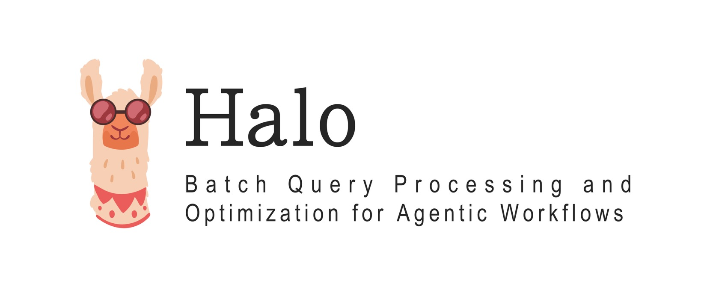
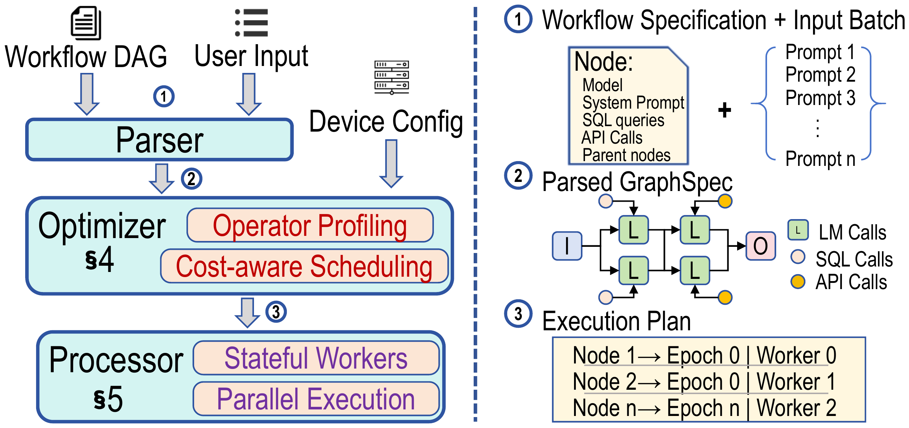

<div style="text-align: center;">
    
    <br>
    <a href="https://arxiv.org/abs/2509.02121" target="_blank">
    
    </a>
</div>


# Halo: Batch Query Processing and Optimization for Agentic Workflows
Here is the prototype for Halo, a novel system that unifies LLM serving with query optimization
to efficiently process batch agentic workflows.

<div style="text-align: center;">
    
</div>

We identify key features in our design:

- **Unified Framework**: Halo integrates LLM serving and query optimization into a single framework, simplifying deployment and management.
- **Batch Processing**: The system is optimized for batch processing, allowing for efficient handling of large volumes of queries leveraging techniques like cache reuse and prefix caching.
- **Query Optimization**: Halo employs advanced techniques to optimize query execution, targeting reduced latency and redundant context exchange while adapting to varying workloads and resource availability.

We hope Halo can be deployed in broader scenarios and achieve larger cost savings in the era of large generative models.
## Installation
1. Install [uv](https://astral.sh/uv/) for environment management:
```bash
curl -LsSf https://astral.sh/uv/install.sh | sh
source ~/.bashrc
```

2. Build Halo's environment:
```bash
uv venv
uv sync
source .venv/bin/activate
```

Pure-LLM workflows need nothing more. Workflows that attach SQL `db_queries`
to a node additionally require a Postgres backend — install that extra with
`uv sync --extra postgres`.

Nodes with `engine: sglang` run on [SGLang](https://github.com/sgl-project/sglang)
instead of vLLM. Current SGLang and vLLM releases pin different PyTorch builds,
so install the SGLang runtime in its own environment; Halo imports each engine
lazily, so there `uv pip install "sglang[all]>=0.5.9" pyyaml pulp && uv pip install --no-deps -e .`
is enough to run SGLang-only templates.

> The DP scheduler has an optional Rust core in the full research build. This
> demo ships the pure-Python implementation only; the DP solver automatically
> falls back to Python, producing identical plans.

## Usage
1. Describe your workflow as a declarative graph (`templates/example_chain.yaml`).
A graph has typed `nodes` (an `input` node plus `inference` nodes with
`engine: vllm`) and `edges` that map one node's outputs into the next node's
inputs:
```yaml
graph:
  name: example_two_stage_cot
  nodes:
    - id: user_input
      type: input
      outputs: [user_query]
    - id: reason
      type: inference
      engine: vllm
      model: meta-llama/Llama-3.2-3B-Instruct
      system_prompt: "Answer with multi-step chain-of-thought reasoning."
      inputs: [user_query]
      outputs: [reasoning]
    - id: answer
      type: inference
      engine: vllm
      model: meta-llama/Llama-3.1-8B-Instruct
      system_prompt: "Using the prior reasoning, give a concise final answer."
      inputs: [user_query, reasoning]
      outputs: [final_answer]
  edges:
    - {from: user_input, to: reason,  mapping: {user_query: "{{ user_query }}"}}
    - {from: reason,     to: answer,  mapping: {user_query: "{{ user_query }}", reasoning: "{{ reasoning }}"}}
```
A node may use `engine: sglang` instead, with the same fields, and a template
may mix both engines: SGLang nodes are costed, planned, and batched like vLLM
nodes, and each GPU worker hosts whichever engine its current node needs.
`engine_kwargs` passed to a processor use vLLM names (e.g.
`gpu_memory_utilization`, `sampling_params={"max_tokens": ...}`); Halo maps
them to SGLang's equivalents and drops options SGLang does not accept.
SGLang starts its scheduler with `spawn`, so run such workflows from a script
guarded by `if __name__ == "__main__":`.

A node may also carry `db_queries` (SQL with `:named` parameters); Halo splits
those into standalone CPU nodes and schedules them alongside the LLM nodes.
Identical SQL statements across the queries of a batch execute once and share
their result. Only read-only statements without volatile functions are shared;
writes run once per query and invalidate cached reads, and a query marked
`coalesce: false` (e.g. one calling a volatile user-defined function) is never
shared. HTTP (`engine: http`) and local-function (`type: processor`)
nodes are coalesced the same way when the template declares them deterministic
with `coalesce: true`; calls are then keyed by the node's bound inputs and
rendered request fields. When a template mixes SQL and HTTP operators, the
planner places them on separate CPU workers so a slow API call cannot block
database work. API and local-function calls can also be embedded in an LLM
node as `tool_calls` (each with a `name`, `kind: http|processor`, and the tool's
fields; `post_llm: true` runs it after the LLM on the LLM's outputs, and an
optional `inputs` list overrides the defaults); the parser extracts them into
standalone tool nodes, just like `db_queries`.

An HTTP node that declares a `url` (with optional `method`, `params`, `headers`,
`json`/`body`, `timeout_s`, and a `response_path` such as
`choices.0.message.content`) issues that request live, so an API-served LLM runs
as an opaque HTTP operator whose profiled latency enters the plan. An HTTP node
that declares a latency (`sleep_s`, `latency_ms`, ...) is served by latency
injection instead, as in the paper's experiments. A graph-level `loops` entry
(e.g. `{nodes: [writer, critic], max_iterations: 3}`) unrolls a bounded loop into
a static DAG; edges that point backwards in the listed order link each iteration
to the next.

2. Parse the graph, build an optimized execution plan, and run a batch:
```python
from halo import GraphTemplateParser, GraphOptimizer, MultiProcessGraphProcessor

# 1) Parse the declarative workflow into a typed graph
graph = GraphTemplateParser("templates/example_chain.yaml").parse()

# 2) Optimize: a single-pass DP picks node order, worker placement, and query
#    order, tracking model/cache reuse. scheduler_mode also accepts
#    "rr_topo", "model_first", "greedy", "minswitch", "milp", or "auto".
optimizer = GraphOptimizer(num_gpus=2, scheduler_mode="dp", plan_mode="default")
plan = optimizer.build_plan(graph, sample_contexts=[{"user_query": "What is a machine learning system?"}])

# 3) Execute the plan over a batch of queries (one context dict per query)
queries = ["What is a machine learning system?", "Explain prefix caching."]
processor = MultiProcessGraphProcessor(persistent_workers=True)
results = processor.run_batch(plan, graph, [{"user_query": q} for q in queries])
processor.close()

for q, ctx in zip(queries, results):
    print(q, "->", ctx.get("final_answer"))
```
For online serving, `StreamingSession(optimizer, processor)` buffers submitted
queries (`submit(graph, context)`) and `flush()` runs them in single-template
mini-batches, re-optimizing at every mini-batch boundary.
`MultiProcessGraphProcessor(max_batch_size="auto")` splits each operator's
instances into two micro-batches. `max_tool_inflight=k` applies backpressure: at
most `k` query instances are in flight per CPU (tool) worker, and further ready
tool tasks wait in the scheduler until the backend drains (off by default).

`build_plan` (planning) runs on CPU; `run_batch` (execution) needs the GPUs and
model weights for the `vllm`/`sglang` nodes. With `plan_mode="profiled"` and `db_queries`
present, planning also profiles SQL via `EXPLAIN`, which requires Postgres.
Before planning, HTTP and local-function nodes are invoked on the sample
contexts and timed; the DP planner uses the mean latency as their cost.

## Citation
If you find this project useful, please consider citing our work:
```bib
@misc{shen2025batchqueryprocessingoptimization,
      title={Batch Query Processing and Optimization for Agentic Workflows}, 
      author={Junyi Shen and Noppanat Wadlom and Yao Lu},
      year={2025},
      eprint={2509.02121},
      archivePrefix={arXiv},
      primaryClass={cs.DB},
      url={https://arxiv.org/abs/2509.02121}, 
}
```